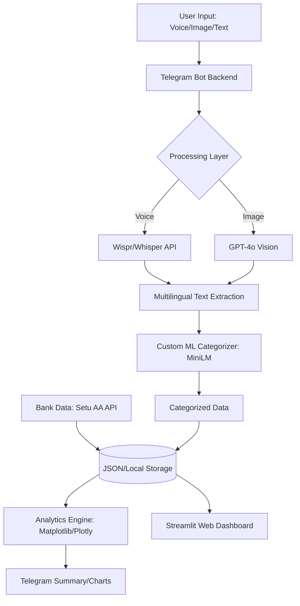

<div align="center">

# 🌌 FineHance Omni
### *The Frictionless, Multimodal Financial Intelligence Ecosystem*

[](LICENSE)
[](https://www.python.org/downloads/)
[](https://reactjs.org/)
[](https://vitejs.dev/)
[](https://huggingface.co/CyberKunju/finehance-categorizer-minilm)

**FineHance Omni** is a next-generation financial assistant designed to completely eliminate the friction of expense tracking. By uniting **Voice Automation**, **Receipt Vision**, a **Custom Transformer Model**, **Setu Open Banking**, and a **Stunning Modern Web Dashboard**, it captures every rupee of your spending with zero effort and provides proactive, professional-grade financial insights.

[Explore the Custom ML Model](https://huggingface.co/CyberKunju/finehance-categorizer-minilm) • [Report Bug](https://github.com/Dawn-Fighter/finehance-omni/issues) • [Request Feature](https://github.com/Dawn-Fighter/finehance-omni/issues)

</div>

---

## 🚀 Core Innovations

Most people abandon personal finance tools because of **input friction**. Opening apps, navigating menus, and manually typing details is tedious. FineHance Omni removes the UI barrier completely.

### 🎙️ 1. Voice-to-Finance (Powered by Wispr)
Don't type. Just talk. Say: *"Hey, I just spent ₹1200 on petrol at Shell."* 
FineHance Omni accurately transcribes the audio, extracts the monetary value, and uses our specialized ML pipeline to instantly log and categorize the transaction. 

### 👁️ 2. Receipt Vision (GPT-4o)
Snap a photo of any receipt, thermal printout, or digital invoice. The system itemizes the entire purchase, extracting line items, taxes, merchant details, and dates with superhuman precision.

### 🧠 3. Custom ML Categorization Engine
Unlike generic GPT wrappers, FineHance Omni relies on a specialized, fine-tuned **MiniLM-L6 Transformer** model:
- **Model Registry:** `CyberKunju/finehance-categorizer-minilm`
- **Precision:** Achieves a massive **96.56% Accuracy** across 23 distinct financial categories.
- **Performance:** Ultra-low latency inference capable of ~6,600 samples/sec, ensuring lightning-fast updates.

### 🏦 4. Automated Open Banking (Setu AA)
Built on the **Setu Account Aggregator** framework for deep Indian banking integration.
- Automatically pulls verified transactions (UPI/IMPS) from major institutions (HDFC, SBI, ICICI, etc.).
- Performs real-time reconciliation against manual and voice logs.

### 🌍 5. Hyper-Localized Multilingual Support
Speak to the assistant in your native tongue. Fully supported languages include:
- **Malayalam (മലയാളം)**
- **Tamil (தமிழ்)**
- **Telugu (తెలుగు)**
- **Kannada (ಕನ್ನಡ)**
- *English & Hindi*

---

## 💻 The Modern Web Dashboard

FineHance Omni features a breathtaking, highly responsive Web Interface built with **React 18**, **Vite**, **Tailwind CSS v4**, and **Framer Motion**.

✨ **Dashboard Features:**
- **Vivien Insights:** A proactive AI agent integrated directly into the dashboard. Vivien analyzes your cash flow, predicts upcoming bills using ARIMA models, and proactively highlights savings opportunities (e.g., identifying redundant SaaS subscriptions).
- **Dynamic Routing:** A fully compartmentalized Single Page Application featuring dedicated, detailed pages for *Transactions*, *Analytics*, *Budgets*, *Invoices*, and *Monthly Summaries*.
- **Deep Ledger Visualization:** Interactive area charts, spending bar graphs, and distribution pies powered by **Recharts**.
- **Unified UX:** Polished interactions with glassmorphism, fluid motion transitions, and Apple-grade HIG principles applied throughout.

---

## 🛠️ Technical Architecture



---

## ⚡ Quick Start Guide

You can run the entire FineHance Omni ecosystem locally. It is split into a Python Backend (Telegram/ML) and a Node.js Frontend (Web Dashboard).

### 1. Clone the Repository
```bash
git clone https://github.com/Dawn-Fighter/finehance-omni.git
cd finehance-omni
```

### 2. Configure Environment Variables
Create a `.env` file in the root directory:
```env
OPENAI_API_KEY=your_openai_key
LLM_MODEL=gpt-4o
TELEGRAM_BOT_TOKEN=your_telegram_bot_token
HF_TOKEN=your_huggingface_token
SETU_CLIENT_ID=your_setu_client_id
SETU_CLIENT_SECRET=your_setu_client_secret
SETU_PRODUCT_INSTANCE_ID=your_setu_instance_id
```

### 3. Start the Intelligence Backend (Python)
```bash
# From the root directory
pip install -r requirements.txt
python bot/bot.py
```
*(Note: If you want to run the legacy Streamlit dashboard, run `streamlit run dashboard/app.py`)*

### 4. Start the Modern Web Dashboard (React)
```bash
# Open a new terminal
cd frontend
npm install
npm run dev
```
Navigate to `http://localhost:5173` to experience the web ecosystem.

---

## 🏷️ ML Supported Categories

The custom MiniLM engine is trained on 23 specialized financial vectors:
`Bills & Utilities` • `Cash & ATM` • `Childcare` • `Coffee & Beverages` • `Convenience` • `Education` • `Entertainment` • `Fast Food` • `Food Delivery` • `Gas & Fuel` • `Giving` • `Groceries` • `Healthcare` • `Housing` • `Income` • `Insurance` • `Other` • `Restaurants` • `Shopping & Retail` • `Subscriptions` • `Transfers` • `Transportation` • `Travel`

---

## 🏆 Project & Hackathon Context
**FineHance Omni** demonstrates the sheer power of combining specialized, fine-tuned ML models with massive multimodal LLM logic and Indian Open Banking APIs. Conceptualized and launched in rapid iterations, the project showcases the transition from a conversational friction-less bot to a full-blown financial command center.

---

<div align="center">
  
**Developed with ❤️ by [Navaneeth K (CyberKunju)](https://github.com/Dawn-Fighter)**  
*FineHance Categorization Model Creator & Full-Stack Developer*

</div>
